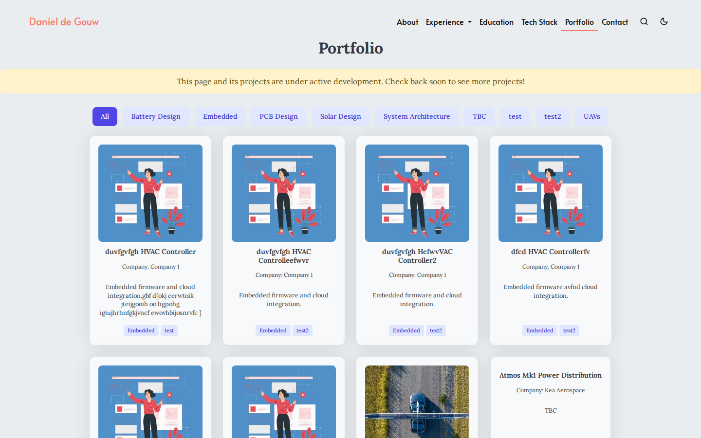
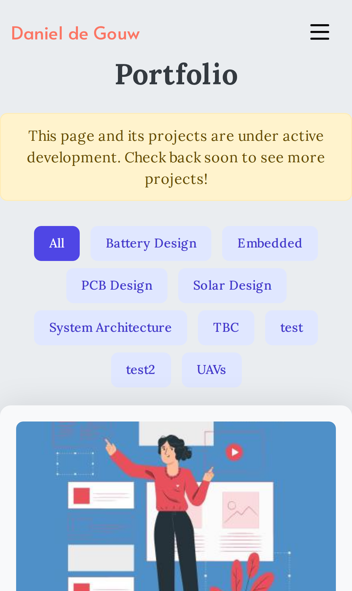
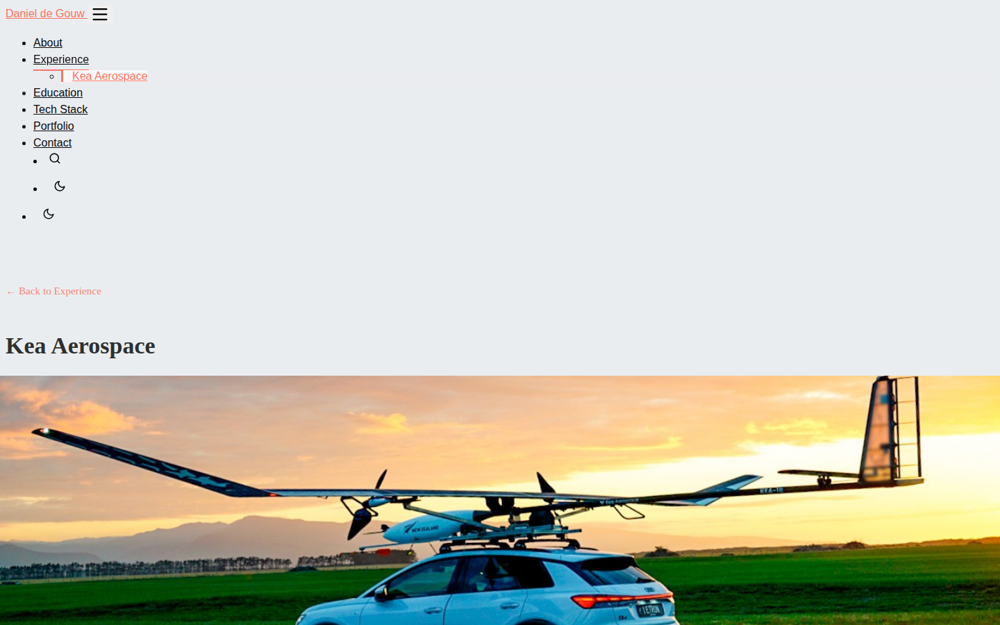
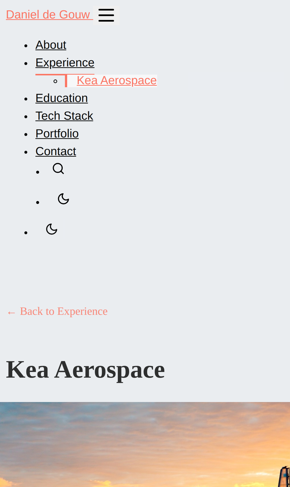
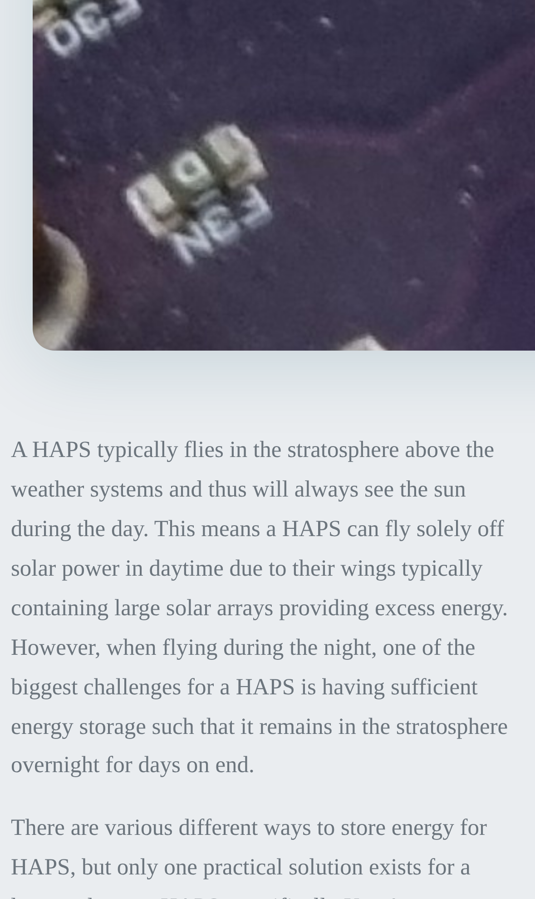

# Changelog

## [Unreleased] — Fix portfolio page overflow and duplicate theme-toggle IDs

The `/portfolio/` page was rendering about 12px wider than the viewport on every device because the pagination controls used a raw Bootstrap grid row without a `.container` wrapper to cancel its negative margins — replaced with a simple centered flex wrapper. Separately, the header's desktop and mobile theme-toggle buttons (and their moon/sun icons) shared duplicate HTML ids, which is invalid markup; each now has a unique id, with the shared CSS moved to the existing classes so the toggle behavior is unchanged. Both found during the same mobile-compatibility QA pass as the fixes above.

**Screenshots**

**Changed files:** `layouts/portfolio/list.html`, `static/css/list.css`, `layouts/partials/sections/header.html`, `static/css/header.css`, `static/css/theme.css`

## [Unreleased] — Mobile fixes: abbreviation underline on project pages, company page back link

Fixed two mobile issues found during a full-site QA pass. The dotted underline under abbreviations (e.g. "HAPS", "RF") was still showing on mobile on portfolio project pages because the CSS fix only targeted company pages — it's now applied to both. Company pages also had no way back to the homepage Experience section besides the nav or browser back button, so a "← Back to Experience" link was added at the top of each company page.

**Screenshots**

**Changed files:** `static/css/single.css`, `layouts/companies/section.html`

## [Unreleased] — CI/CD: align Hugo version across ci.yml and hugo.yml

Found during a `portfolio-automation` provisioning audit: `ci.yml` was floating on `hugo-version: 'latest'` while `hugo.yml` (the actual live deploy) was pinned to `0.125.7` — neither matched the `0.139.3` already installed on the dev VM and used by the local `.githooks/pre-push` build gate. Three different Hugo versions validating "the same build" undercut the point of that gate: something could pass locally and in CI while behaving differently on the older Hugo actually deploying. Pinned both workflows to `0.139.3` so all three agree.

**Changed files:** `.github/workflows/ci.yml`, `.github/workflows/hugo.yml`

## [Unreleased] — Widen mobile tap target on Experience "Read More" pill

The "Read More →" pill on the homepage Experience section (e.g. the Kea Aerospace entry) was ~33px tall on mobile, under the 44px accessibility guideline for touch targets. Added mobile-only padding in `static/css/experience.css`, confirmed 67px tall on iPhone 15; desktop is unaffected. Found during the same mobile QA pass as the abbreviation underline and company-page back link fixes above.

**Changed files:** `static/css/experience.css`
